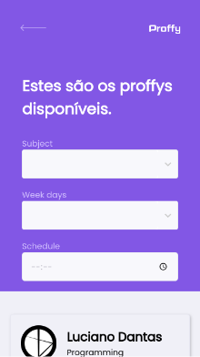
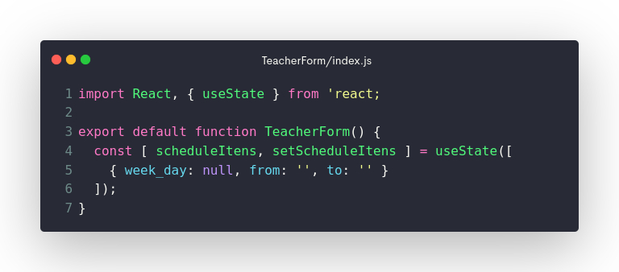
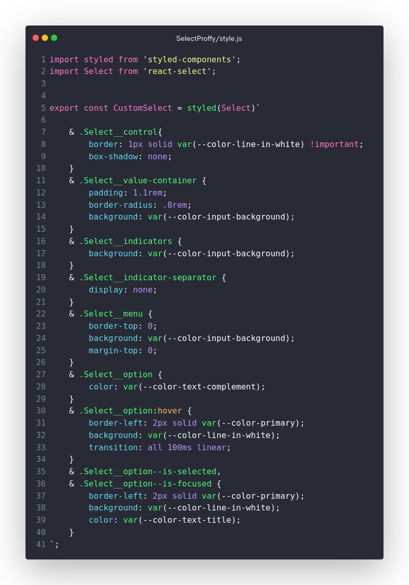
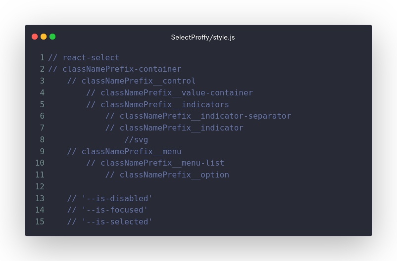
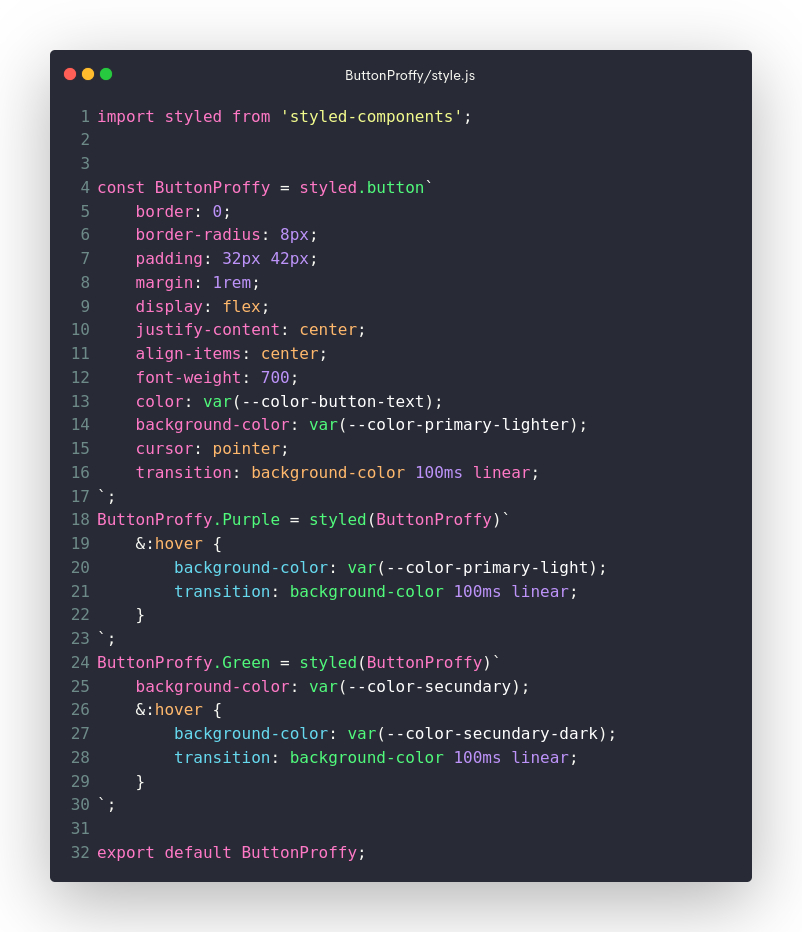
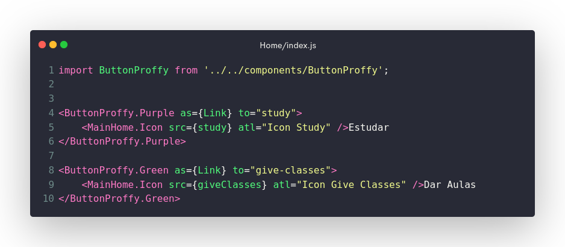

#  Proffy

> Projeto criado na NLW#2 (Next Level Week #2) usando a metodologia mobile first.

## Tecnologias:
- react
  - [useState](#usestate)
- [react-select](#react-select)
- [styled-components](#styled-components)

## react
### useState()

>No uso do useState() não há muita novidade para mim, pois eu já tinha tido contado com ele

## react-select

Porém, com o react-select foi meu primeiro contato com ele e devo dizer que foi um tanto complicado no começo de entender como funcionava a mudança de estilo em conjunto com styled-components, mas consegui e fiquei bastante satisfeito com o resultado...

e abaixo estão as classes css que consegui identificar para fazer as mudanças no estilo do select usado

[back-top](#tecnologias)

## styled-components

Apesar de ter um pouco mais de conforto com styled-components, neste projeto aprendi que, a partir de um component de estilo criado, dá para criar outros tendo ele como base sem ter a necessidade de importar todos eles no local onde será usado.

Vou explicar:

`ButtonProffy` é o elemento importado no código acima, porém, a partir dele eu estou instanciando os dois, `ButtonProffy.Purple` e `ButtonProffy.Green`, elementos de button sem ter a necessidade de te-los importado, que foi criado no ButtonProffy/style.js

[back-top](#tecnologias)

